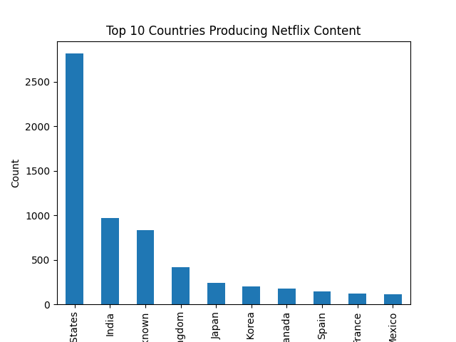
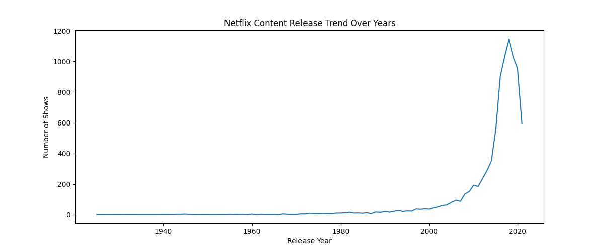
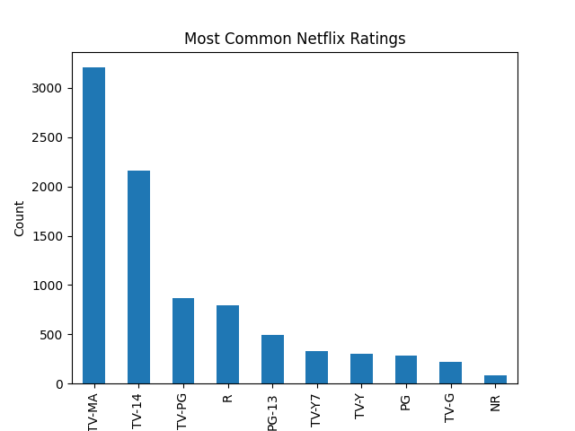

# Netflix Data Analysis Project

## Overview
This project performs exploratory data analysis (EDA) on Netflix movies and TV shows using Python, Pandas, and Matplotlib.

The goal was to explore trends in Netflix content, including:
- Content types
- Country distribution
- Release year trends
- Audience ratings

---

## Tools Used
- Python
- Pandas
- Matplotlib
- Jupyter Notebook

---

## Key Insights
- Netflix contains significantly more movies than TV shows
- United States produces the highest amount of Netflix content
- Netflix content increased rapidly after 2015
- TV-MA and TV-14 are the most common ratings

---

## Project Structure
- data/ → dataset
- notebooks/ → Jupyter analysis notebook
- images/ → saved visualizations

---

## Visualizations

### Top Countries Producing Netflix Content

### Netflix Release Trend

### Most Common Ratings

---

## Skills Demonstrated
- Data Cleaning
- Exploratory Data Analysis (EDA)
- Data Visualization
- Python Programming
- Git & GitHub

---

## Author
Meghana Palagani